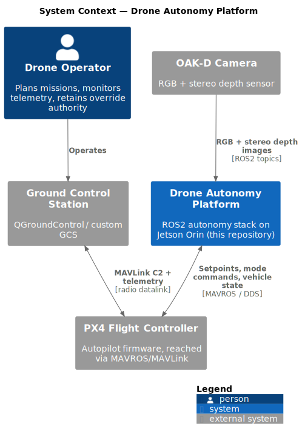

<!-- GENERATED FILE — do not edit by hand. Regenerate with: python scripts/generate_c4.py -->
# C4 Level 1 — System Context

Diagram source: [`level1_context.puml`](level1_context.puml) (C4-PlantUML, rendered with Graphviz).

The context view is maintained from the `EXTERNAL_SYSTEMS` table and the
static context template in `scripts/generate_c4.py` — update those when an
external actor or system changes.
