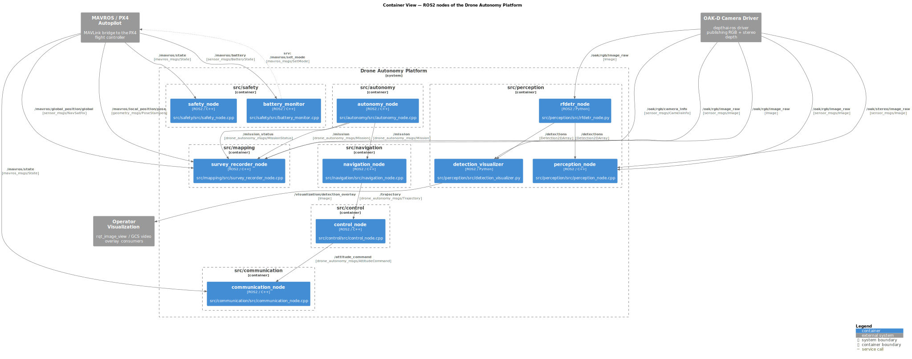

<!-- GENERATED FILE — do not edit by hand. Regenerate with: python scripts/generate_c4.py -->
# C4 Level 2 — Container View (ROS2 Nodes)

Every deployable ROS2 node in `src/`, grouped by package, with topic and
service flows extracted from the source. Dashed edges are *needs remap*
candidates matched by topic basename only — see [`topics.md`](topics.md)
for details.

Diagram source: [`level2_container.puml`](level2_container.puml) (C4-PlantUML, rendered with Graphviz).
