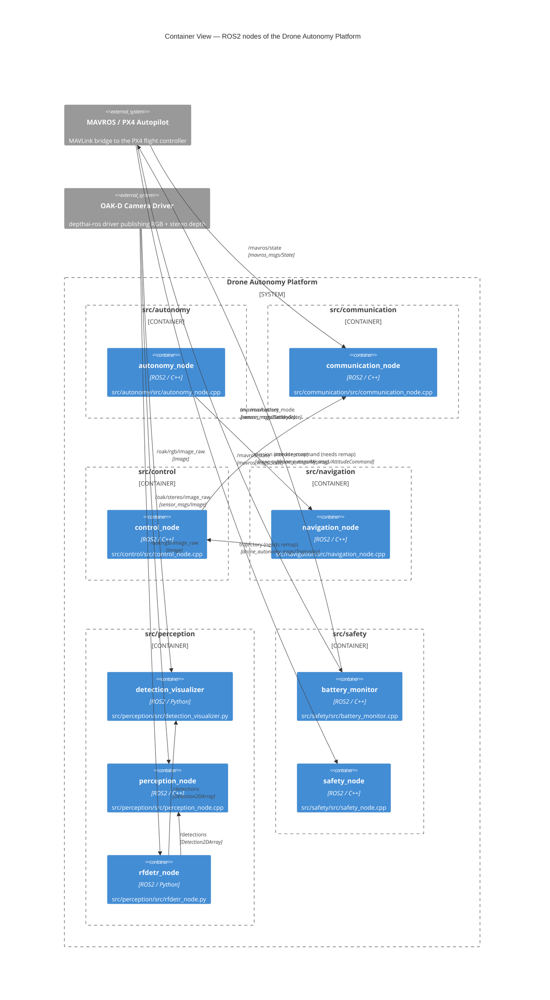

<!-- GENERATED FILE — do not edit by hand. Regenerate with: python scripts/generate_c4.py -->
# C4 Level 2 — Container View (ROS2 Nodes)

Every deployable ROS2 node in `src/`, grouped by package, with topic and
service flows extracted from the source. Edges labelled *needs remap* match
by topic basename only — see `topics.md` for details.

