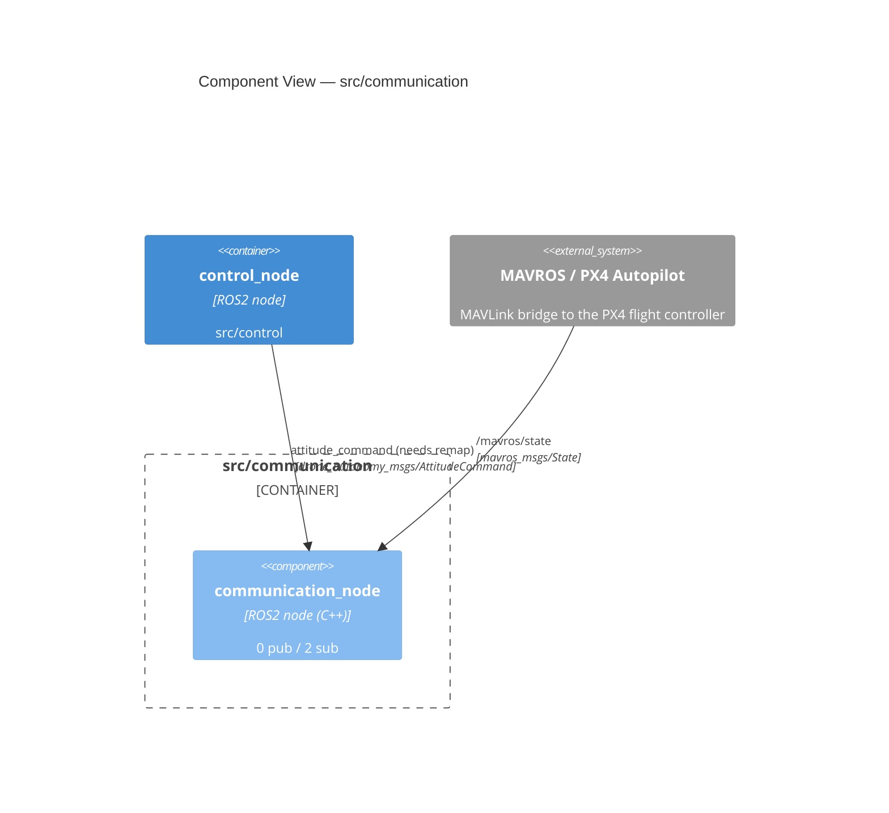

<!-- GENERATED FILE — do not edit by hand. Regenerate with: python scripts/generate_c4.py -->
# C4 Level 3 — Component View: `src/communication`

## Interfaces

| Node | Direction | Topic / Service | Type |
|---|---|---|---|
| `communication_node` | subscribes | `/communication_node/attitude_command` | `drone_autonomy_msgs/AttitudeCommand` |
| `communication_node` | subscribes | `/mavros/state` | `mavros_msgs/State` |
