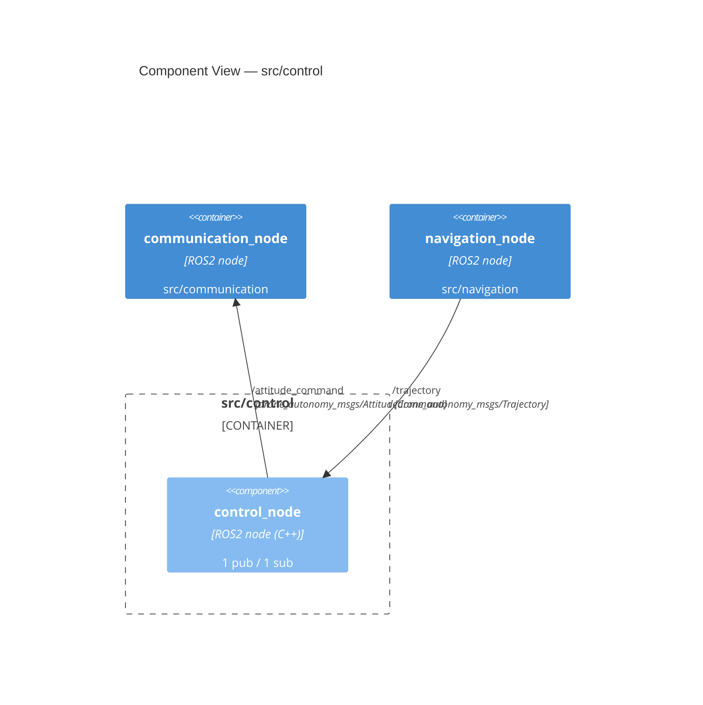

<!-- GENERATED FILE — do not edit by hand. Regenerate with: python scripts/generate_c4.py -->
# C4 Level 3 — Component View: `src/control`

## Interfaces

| Node | Direction | Topic / Service | Type |
|---|---|---|---|
| `control_node` | publishes | `/attitude_command` | `drone_autonomy_msgs/AttitudeCommand` |
| `control_node` | subscribes | `/trajectory` | `drone_autonomy_msgs/Trajectory` |
