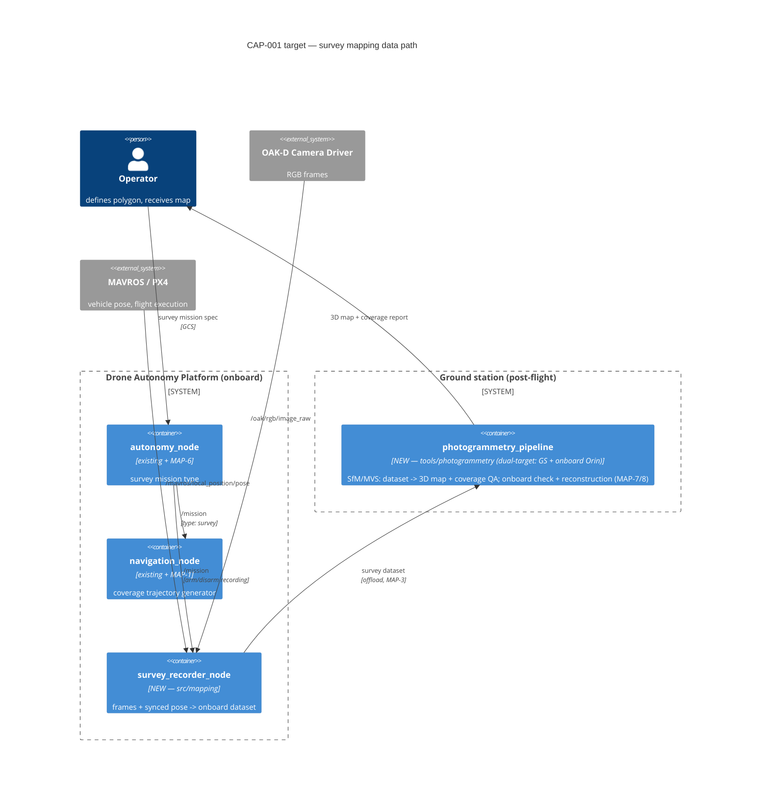

# CAP-001 — Visual Photogrammetry / Survey Mapping

**Status:** Draft (designer iterating)
**Stakeholder requirement:** STK-1 — Post-Flight 3D Survey Mapping
**Target spec:** [docs/architecture/target/CAP-001-photogrammetry.yaml](../architecture/target/CAP-001-photogrammetry.yaml)
**Gap report:** [docs/reports/gap_CAP-001.md](../reports/gap_CAP-001.md) (generated — rerun `python scripts/check_architecture_gap.py`)
**Implementation plan:** [CAP-001-implementation-plan.md](CAP-001-implementation-plan.md) (WP → task breakdown, execution/review model)
**Test plan:** [docs/test_plans/TP-002-survey-mapping.md](../test_plans/TP-002-survey-mapping.md)

## Stakeholder need

The UAV shall fly a survey mission and create, post-flight, a complete
georeferenced 3D map from all visual data collected (STK-1). Acceptance:
≥95% polygon coverage, ≤5 cm GSD, map product ≤2 h after landing, no manual
steps between offload and product.

## Operational concept (ConOps)

1. **Plan** — operator defines survey polygon, altitude, and overlap at the
   GCS; tasks the platform with a mission of type `survey` (MAP-6).
2. **Fly** — mission manager dispatches the survey mission; navigation
   generates a lawnmower coverage trajectory meeting overlap constraints
   (MAP-1); control/MAVROS fly it (existing DES-001 chain).
3. **Capture** — for the duration of the mission, the survey recorder
   persists camera frames with time-synchronized vehicle pose onboard (MAP-2).
4. **Land & check on device** — the companion (Orin Nano class) runs the
   pipeline's consistency-check mode on the recorded dataset within 15 min of
   mission completion (MAP-7); the operator re-flies gaps **before leaving
   the site** if predicted coverage fails.
5. **Offload** — operator retrieves the survey dataset as a single
   documented package (MAP-3).
6. **Reconstruct** — the photogrammetry pipeline turns the dataset into a
   georeferenced point cloud + textured mesh, unattended (MAP-4); the same
   pipeline is executable onboard as a post-flight step (MAP-8).
7. **Validate** — coverage QA against the survey polygon (MAP-5); operator
   re-tasks only if acceptance criteria fail.

## Target architecture

Two new modules (one onboard, one offboard) plus behavior added to two
existing nodes. Everything else reuses the platform as-is.



Design decisions are fixed in the DES docs (written by the designer-class
model, per the v0.4 review direction): DES-003 (mission/trajectory), DES-004
(dataset format, sync, trigger), DES-005 (engine, dual-target execution).
See the implementation plan's "Resolved design decisions" table.

## Gap to current architecture

From the generated report (rerun after every implementation merge):
**6/18 present, 12 gaps** (v0.4 added the onboard-processing behaviors
MAP-7/MAP-8 and the GNSS + mission-status recorder flows). What exists
already: the tasking chain (`/mission`, `/trajectory` — DES-001), the camera
and pose sources, both host nodes for the new behaviors. What's missing
clusters into exactly the work packages below. `/perception_node/sensor_data`
(DES-002) is *not* on this path — survey capture records raw frames, not
fused decision data.

## Requirements derived

| UID | Level | What |
|---|---|---|
| STK-1 | Stakeholder | fly survey → complete post-flight 3D map |
| MAP-6 | System | survey mission type (autonomy) |
| MAP-1 | System | coverage trajectory generation (navigation, ⚠ safety-critical) |
| MAP-2 | System | synchronized frame+pose recording |
| MAP-3 | System | dataset offload format |
| MAP-4 | System | unattended post-flight reconstruction |
| MAP-5 | System | ≥95% coverage (validation) |
| MAP-7 | System | onboard post-flight consistency check ≤15 min (companion) |
| MAP-8 | System | reconstruction pipeline executable on companion |

## Implementation handoff (the detailed loop)

Ordered work packages. Each is sized for one implementation session
(Opus/Sonnet-class Claude Code session or `submit_task.py` plan) and has a
machine-checkable exit: its gap-report lines flip to ✅ and traceability
markers land.

| WP | Scope | Design doc | Requirements | Agents / queue | Exit criteria |
|---|---|---|---|---|---|
| WP-1 | Survey mission type + coverage trajectory generator | [DES-003](../design/DES-003-survey-mission-coverage-trajectory.md) | MAP-6, MAP-1 | `autonomy-dev`, `nav-dev` / `ros2-dev` — **safety_critical: true** (navigation) | behaviors MAP-6, MAP-1 ✅; SITL flies a polygon survey (TS-04) |
| WP-2 | `survey_recorder_node` (new `src/mapping` pkg) + subscriptions | [DES-004](../design/DES-004-survey-dataset-recording.md) | MAP-2, MAP-3 | `infra` (package scaffold) → `perception-dev` / `ros2-dev` | container + 5 flows ✅; replay dataset validates (TS-05..07) |
| WP-3 | `tools/photogrammetry` **dual-target** pipeline (GS + onboard) + coverage QA | [DES-005](../design/DES-005-photogrammetry-pipeline.md) | MAP-4, MAP-5, MAP-7, MAP-8 | `ml-pipeline` / `ml-pipeline` | container + onboard behaviors ✅; TS-08/09 CI, TS-10/11 Jetson HIL |
| WP-4 | Validation: SITL end-to-end survey + field procedure | [TP-002](../test_plans/TP-002-survey-mapping.md) TS-12/13 | MAP-5, MAP-7, STK-1 | Sonnet session + `run_simulation` stage | `Verifies:` markers land; STK-1 acceptance demonstrated |

Task-level breakdown, execution/review roles, and per-WP `submit_task.py`
plans: [CAP-001-implementation-plan.md](CAP-001-implementation-plan.md).

Example plan for WP-2 (adjust after DES-004 is approved):

```json
{
  "summary": "Add survey_recorder_node recording synced frames+pose (CAP-001 WP-2). SITL check for run_simulation: run survey mission stub, assert dataset contains N frames with pose deltas < sync budget",
  "safety_critical": false,
  "affected_packages": ["src/mapping"],
  "steps": [
    {"agent": "infra", "task_queue": "orchestrator",
     "action": "Scaffold src/mapping package (CMakeLists, package.xml, launch) per DES-004",
     "depends_on": []},
    {"agent": "perception-dev", "task_queue": "ros2-dev",
     "action": "Implement survey_recorder_node: subscribe /oak/rgb/image_raw + /mavros/local_position/pose + /mission, write synced dataset per DES-004; mark Implements: MAP-2, MAP-3. Author TP-002 MAP-2/MAP-3 tests (sync budget, manifest schema); mark Verifies: MAP-2, MAP-3",
     "depends_on": [0]}
  ]
}
```

Note: no `sim-test` step in the plan — the `simulation` queue serves only the
workflow's built-in `run_simulation` stage, which runs automatically after
the plan steps with the plan text as its scenario (see the implementation
plan's harness constraints).

## Validation plan

Mission-level (validates STK-1, not code units): SITL survey over a reference
polygon → dataset → pipeline → coverage ≥95% asserted automatically (WP-4 /
TP-002); one field flight repeats the same procedure on hardware and its
results are filed as a dated report (`report` skill).

## Designer iteration log

- v0.1 — initial target architecture and decomposition; gap 6/14.
- v0.2 — implementation plan written (CAP-001-implementation-plan.md): WPs
  broken into Sonnet-executable tasks with Opus review and human WP gates;
  TP-002 verification/validation plan added. Gap unchanged (6/14 — no code
  yet). Next action: human approval of the plan, then T1.1 (DES-003).
- v0.3 — PR #22 review fixes: `sim-test` removed as a plan step everywhere
  (the `simulation` queue serves only the workflow's built-in
  `run_simulation` stage); safety-critical human gates documented as
  PR-level since `submit_task.py` auto-approves the in-workflow gate.
- v0.4 — designer review on commit 5dcf5cf, three fundamental changes:
  (1) pipeline is dual-target — also executable on the Orin-class companion
  as onboard consistency check (new MAP-7) and onboard reconstruction (new
  MAP-8); target YAML gains 2 behaviors + 2 recorder flows. (2) Design
  decisions pre-scoped by the designer-class model: DES-003/004/005 written
  with per-task specifications; human reviews at WP level (PR) only, Opus
  reviews every task. (3) TP-002 rewritten with full test specs TS-01..TS-13.
  Skills (`capability`, `test-plan`, `design`) updated to encode this.
