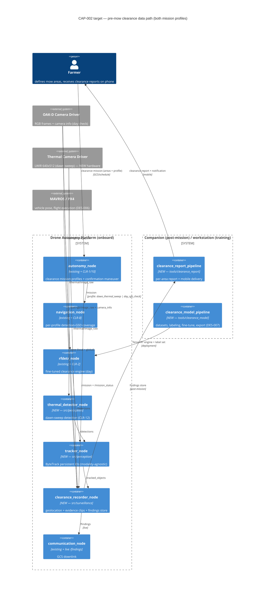

# CAP-002 — Pre-Mow Field Clearance Surveillance

**Status:** Draft v0.2 (plan awaiting owner approval)
**Stakeholder requirement:** STK-2 — Pre-Mow Field Clearance Surveillance
**Target spec:** [docs/architecture/target/CAP-002-premow-clearance.yaml](../architecture/target/CAP-002-premow-clearance.yaml)
**Gap report:** [docs/reports/gap_CAP-002.md](../reports/gap_CAP-002.md) (generated — rerun `python scripts/check_architecture_gap.py`)
**Sensing/model/data plan:** [DES-007](../design/DES-007-clearance-sensing-and-model.md) (written — ranges, occlusion, camera trade, thermal, collection & labeling)
**Implementation plan:** [CAP-002-implementation-plan.md](CAP-002-implementation-plan.md) (WP → task breakdown)
**Design docs:** [DES-007](../design/DES-007-clearance-sensing-and-model.md) · [DES-008](../design/DES-008-clearance-mission-and-confirmation.md) · [DES-009](../design/DES-009-tracker-node.md) · [DES-010](../design/DES-010-clearance-recorder.md) · [DES-011](../design/DES-011-clearance-report-and-delivery.md) (all written, per-task scoped)
**Test plan:** [TP-003](../test_plans/TP-003-premow-clearance.md) (full test specs TS-01..TS-19)

## Stakeholder need

Hours before mowing, the farmer needs assurance that the fields to be mowed
are free of animals, people (especially children), and other obstructions.
The capability is **two autonomous flights per mowing day** (STK-2):

1. a **dawn thermal sweep** — overnight-cooled ground gives maximum thermal
   contrast, and bedded animals (the classic fawn-in-tall-grass mower
   casualty) are detectable even when concealed in vegetation;
2. a **daytime visual final check** shortly before mowing — RGB detection of
   everything surface-visible that is present or has moved in since dawn.

Each flight delivers a per-field clearance report (verdict, geolocated
findings, evidence clips, coverage holes) to the farmer's phone. Acceptance:
≥95% area coverage with flagged holes, one finding per physical object,
≤5 m geolocation error, ≥3 s evidence clips, report on the phone ≤5 min
after mission completion, zero human interpretation of raw mission data,
and every heated animal-surrogate — including fully concealed placements —
found in the dawn-sweep validation.

The value add is the autonomy: the farmer receives machine-processed
findings, not a video feed to watch. Phase 1 keeps a human flight safety
monitor; detect-and-avoid automation is explicitly Phase 2 (FE-2).

## Operational concept (ConOps)

1. **Define (once)** — the farmer registers named mow-area polygons and a
   mobile delivery endpoint; reused every mowing cycle.
2. **Task** — on the mowing day, the farmer (or a schedule) dispatches
   clearance missions with a profile: `dawn_thermal_sweep` in the early
   morning, `day_rgb_check` shortly before mowing (CLR-1).
3. **Fly** — the mission manager dispatches; navigation generates a coverage
   trajectory parameterized for the profile's detection GSD (CLR-8, DES-007
   operating points); the DES-006 bridge/PX4 fly it (prerequisite from the
   CAP-001 stream).
4. **Detect** — the profile's detection chain runs onboard: fine-tuned
   RF-DETR on `rfdetr_node` for the day check (CLR-2), the thermal detector
   for the dawn sweep (CLR-11/12); `tracker_node` associates detections into
   persistent-ID tracks so one animal is one finding (CLR-3).
5. **Confirm** — low-confidence candidates trigger the confirmation
   maneuver: the craft descends over the finding and re-runs inference on a
   native-resolution crop (~5× effective-GSD gain — v1's "zoom" is craft
   movement, CLR-10); over-budget candidates are reported unconfirmed.
6. **Localize & capture** — `clearance_recorder_node` geolocates each track
   (pixel → WGS84 via camera intrinsics + synced pose, CLR-4), filters to the
   mow polygons, and records an evidence clip with pre-roll plus a structured
   finding record (CLR-5); live findings go to the GCS link on `/findings`.
7. **Report** — on mission completion the companion computer builds the
   clearance report: per-area verdict (CLEAR / N findings), finding map,
   clips, explicit coverage holes, and the modality limitation note (CLR-6).
8. **Deliver** — the report package is pushed to the farmer's registered
   mobile device with a verdict notification (CLR-7); the farmer reviews
   clips and decides whether/where to investigate before mowing.

## Target architecture

Three new onboard nodes, one new external sensor, two new offboard modules,
plus behavior added to four existing nodes. The mission/flight chain and the
RGB detection front-end are reused from the platform as-is.

### Design decisions fixed at capability level

| # | Decision | Choice | Rejected alternative |
|---|---|---|---|
| C1 | Inference location | **Onboard** on the existing `rfdetr_node` / new thermal detector (within PLAT-1 envelope) | Offboard inference over the video downlink — link-dependent; recorded as FE-3 |
| C2 | Coverage planner | **Reuse the MAP-1 lawnmower generator**, parameterized per mission profile (DES-007 operating points) | A new surveillance-specific planner — duplicate of an existing safety-critical component |
| C3 | Evidence product | **Short clips + structured findings**, not full-mission video | Full video to the phone — storage, bandwidth, and farmer review time all fail the "machine does the interpretation" premise |
| C4 | Detector reuse | **Same `rfdetr_node`, new engine + label set** for the day check; thermal gets its own lightweight node publishing the same `/detections` | A second RGB detector node — two engines don't fit the Orin envelope alongside cuVSLAM |
| C5 | Sensor modalities | **Dual-modality mandatory:** LWIR thermal dawn sweep (concealed animals, O3 occlusion) + RGB daytime final check (surface-visible, O0–O2). Split derived in DES-007 §2 | RGB-only — cannot see the classic mower casualty (fawn bedded in tall grass); rejected on owner review of v0.1 |
| C6 | Delivery transport | Resolved in DES-011: **LTE upload + push notification preferred**, local-WiFi/GCS fallback | Baking a transport into the capability now — link availability is site-specific |
| C7 | v1 camera system | **Single fixed camera, positioned by craft movement:** confirmation maneuver = descend + native-resolution crop inference (~5× effective-GSD gain, DES-007 §3.1) | Gimbal + optical zoom now — right target evolution, recorded as FE-1 with an explicit adoption trigger; v1 money goes to the data program |

## Gap to current architecture

From the generated report: **9/38 present, 29 gaps.** What exists already:
the tasking chain (`/mission`, `/trajectory`), the RGB camera/pose sources,
the deployed RF-DETR detection front-end, and all four host nodes for the
new behaviors. What's missing clusters into the work packages below: the
clearance-domain RGB model (CLR-2/9), the thermal chain — sensor, detector,
dawn profile (CLR-11/12), tracking (CLR-3), the confirmation maneuver
(CLR-10), the surveillance recorder with geolocation and evidence capture
(CLR-4/5), report generation and mobile delivery (CLR-6/7), and the
mission-profile/coverage behaviors (CLR-1/8).

**External prerequisites (not CAP-002 gaps):** real flight requires the
DES-006 flight-controller command bridge (CAP-001 stream); the thermal
hardware purchase (DES-007 D3) requires owner sign-off.

## Requirements derived

| UID | Level | What |
|---|---|---|
| STK-2 | Stakeholder | dawn thermal sweep + daytime final check → reports on farmer's phone |
| CLR-1 | System | clearance mission type with per-profile dispatch (autonomy) |
| CLR-2 | System | day-check RGB detection performance, O0–O2, range/occlusion-binned (perception/ML) |
| CLR-3 | System | persistent object tracking, modality-agnostic (perception) |
| CLR-4 | System | finding geolocation ≤5 m (surveillance) |
| CLR-5 | System | evidence clip capture with pre-roll, both modalities (surveillance) |
| CLR-6 | System | per-area clearance report, coverage holes flagged (companion) |
| CLR-7 | System | mobile report delivery ≤5 min (comms) |
| CLR-8 | System | per-profile surveillance coverage trajectory (navigation, ⚠ safety-critical) |
| CLR-9 | System | training-data provenance + labeling program (ML) |
| CLR-10 | System | finding confirmation maneuver — descend + native crop (autonomy/navigation, ⚠ safety-critical) |
| CLR-11 | System | LWIR thermal sensor integration (perception/hardware) |
| CLR-12 | System | concealed-animal thermal detection incl. O3 (perception/ML) |

## Implementation handoff (the detailed loop)

Ordered work packages; per-WP task tables, dataset candidates, and
`submit_task.py` plans in
[CAP-002-implementation-plan.md](CAP-002-implementation-plan.md).
**All design docs are written and per-task scoped** (DES-007..DES-011 +
TP-003) — executors implement resolved designs; a task needing a design
change stops and returns to the designer.

| WP | Scope | Design doc | Requirements | Agents / queue | Exit criteria |
|---|---|---|---|---|---|
| WP-A | **RGB clearance model**: dataset licensing, collection campaigns R1–R3, labeling, operating-point experiment (OP-1 vs OP-2), fine-tune, range/occlusion-binned eval, TensorRT deployment | [DES-007](../design/DES-007-clearance-sensing-and-model.md) §1–2, §5 | CLR-2, CLR-9 | `ml-pipeline` / `ml-pipeline` | CLR-2/CLR-9 lines ✅; TS-12/TS-13 green; model card + provenance manifest |
| WP-B | Clearance mission profiles + per-profile coverage + **confirmation tour** | [DES-008](../design/DES-008-clearance-mission-and-confirmation.md) | CLR-1, CLR-8, CLR-10 | `autonomy-dev`, `nav-dev` / `ros2-dev` — **safety_critical: true** | behaviors CLR-1, CLR-8, CLR-10 ✅; TS-01..04, TS-11 green |
| WP-C | `tracker_node` (vendored ByteTrack, modality-agnostic, `src/perception`) | [DES-009](../design/DES-009-tracker-node.md) | CLR-3 | `perception-dev` / `ros2-dev` | container + `/detections` flows ✅; TS-05 green |
| WP-D | `clearance_recorder_node` (new `src/surveillance`): geolocation, polygon filter, clips + findings store, `/findings` | [DES-010](../design/DES-010-clearance-recorder.md) | CLR-4, CLR-5 | `infra` → `perception-dev` / `ros2-dev` | container + flows + CLR-4/5 behaviors ✅; TS-06..08 green |
| WP-E | `tools/clearance_report`: report build + ntfy/upload delivery; `/findings` downlink | [DES-011](../design/DES-011-clearance-report-and-delivery.md) | CLR-6, CLR-7 | `ml-pipeline` + `comms-dev` | CLR-6/7 lines ✅; TS-09/TS-10 green |
| WP-G | **Thermal integration**: sensor bring-up, driver/EXTERNAL_SYSTEMS, mount, sync, recorder thermal support | [DES-007](../design/DES-007-clearance-sensing-and-model.md) §4.1, §4.3 | CLR-11 | `infra`, `perception-dev` / `ros2-dev` | thermal_cam + `/thermal/image_raw` flows ✅; TS-14 green — **blocked on sensor purchase (owner)** |
| WP-H | **Thermal detection**: classical baseline → E-THERM gate → (if needed) fine-tuned model; T1/T2 dawn campaigns | [DES-007](../design/DES-007-clearance-sensing-and-model.md) §4.2, §5 | CLR-12 | `ml-pipeline`, `perception-dev` | thermal_detector_node + CLR-12 behavior ✅; TS-15 green incl. O3 |
| WP-F | Validation: SITL end-to-end both profiles + field trials (day surrogates, dawn heated decoys) | [TP-003](../test_plans/TP-003-premow-clearance.md) TS-16..19 | STK-2, CLR-* | Sonnet session + `run_simulation` stage | `Verifies:` markers land; STK-2 acceptance (a)–(f) demonstrated |

WP-A is the long pole and starts immediately (dataset/licensing/campaign
prep needs no ROS work). WP-H's dataset/baseline prep also starts early;
its hardware-dependent tasks and WP-G wait on the sensor purchase.
WP-B/C/D interfaces are fixed in the DES docs so they run in parallel;
WP-E needs DES-010's findings-store format; WP-F needs everything merged
plus DES-006.

## Validation plan

Mission-level (validates STK-2, not code units), captured as TP-003 with WP-F:

- **SITL end-to-end (both profiles):** Gazebo world with a reference mow
  polygon and simulated targets → dispatch each profile → assert exactly one
  finding per placed target, geolocation within tolerance, confirmation
  maneuver triggered for low-confidence plants, clips present, report with
  correct verdicts and flagged coverage holes.
- **Model validation (WP-A / WP-H):** E-RGB and E-THERM held-out gates,
  binned by range × occlusion × class (DES-007 §5.4) — aggregate-only
  numbers are not acceptance evidence (D6).
- **Field trials:** day check — surrogate targets (person-analogue
  mannequins incl. child-scale, animal decoys) at surveyed positions in
  graded grass; dawn sweep — **heated decoys including fully concealed O3
  placements** (STK-2(f)); verify acceptance (a)–(f) including
  report-on-phone timing; results filed as dated reports (`report` skill).

## Future extensions (explicitly deferred, not forgotten)

| ID | Extension | Trigger to schedule |
|---|---|---|
| FE-1 | **Gimbal + optical-zoom camera** replacing the confirmation maneuver (stand-off localize-and-zoom; DES-007 §3.2 trade) | Field data: confirmation time >20% of mission, persistent unconfirmed candidates, or evidence-quality complaints |
| FE-2 | **Phase 2 airborne safety automation** — detect-and-avoid, autonomous safety monitor replacing the human observer | Stakeholder Phase-2 go; ties to E2E-2 fast-reaction follow-up from DES-006 |
| FE-3 | **Offboard/edge inference** when the telemetry link allows (larger models than the Orin envelope) | Field data shows onboard model recall ceiling; LTE link validated |
| FE-4 | **Generic "unknown obstruction" detection** (change detection against a prior clean pass) — objects outside the trained class set | ≥2 mowing cycles of reference imagery per field available |
| FE-5 | **Live in-flight alerts to the phone** (finding pushed immediately rather than in the post-mission report) | CLR-7 transport proven; farmer feedback requests it |

## Designer iteration log

- v0.1 — initial capability plan: STK-2 + CLR-1..9 (Draft), target spec,
  gap baseline 9/30, WP-A..WP-F decomposition with the ML work package
  (dataset licensing, labeling plan, fine-tune) as the emphasized long pole.
- v0.2 — owner review of PR #28, three changes: (1) **thermal is mandatory**,
  not FE — the capability is two flights (dawn thermal sweep for concealed
  animals + daytime RGB final check); new CLR-11/12, WP-G/WP-H, thermal
  chain in the target spec (gap 9/37). (2) **DES-007 written now** as the
  dedicated sensing/model/data plan: effective-GSD range analysis (512-input
  penalty → fawn-size class floor + operating-point experiment), grass-
  occlusion grades O0–O3 dividing RGB vs thermal claims honestly, camera
  trade (v1 fixed cam + confirmation maneuver CLR-10; gimbal+zoom → FE-1),
  collection campaigns with heated decoys + staked ground truth, labeling
  protocol with occlusion/range binning. (3) Day RGB flight explicitly
  scoped as the final safety check. STK-2 statement + acceptance updated
  ((f) dawn concealed-decoy criterion).
- v0.3 — handoff completed for agentic execution: DES-008 (mission
  profiles, multi-area coverage, **post-pass confirmation tour** D4/D5 —
  confirmation flies at 10 m full-frame, native-crop inference reserved),
  DES-009 (vendored ByteTrack, `Detection2D.id` reuse, min_hits gate),
  DES-010 (findings store `format_version: 1`, flat-ground ray-cast with
  3 m RSS error budget, `track.csv` for coverage QA), DES-011 (self-
  contained HTML report bundle, verdict rules incl. never-CLEAR-with-holes,
  ntfy + upload delivery with landing-WiFi fallback) and TP-003
  (TS-01..TS-19) written. Target spec gains the
  `clearance_recorder_node → autonomy_node /findings` flow (CLR-10
  confirmation queue); gap 9/38. WPs are now executable by Sonnet-class
  sessions per the implementation plan.
