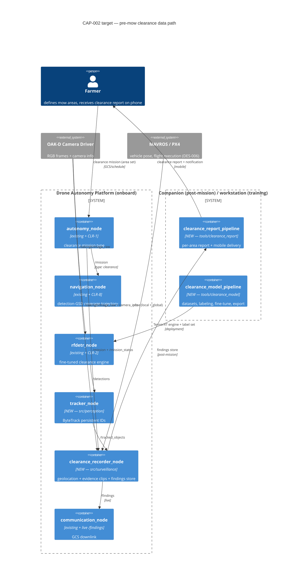

# CAP-002 — Pre-Mow Field Clearance Surveillance

**Status:** Draft v0.1 (plan awaiting owner approval)
**Stakeholder requirement:** STK-2 — Pre-Mow Field Clearance Surveillance
**Target spec:** [docs/architecture/target/CAP-002-premow-clearance.yaml](../architecture/target/CAP-002-premow-clearance.yaml)
**Gap report:** [docs/reports/gap_CAP-002.md](../reports/gap_CAP-002.md) (generated — rerun `python scripts/check_architecture_gap.py`)
**Implementation plan:** [CAP-002-implementation-plan.md](CAP-002-implementation-plan.md) (WP → task breakdown)
**Test plan:** TP-003 (reserved — authored with the DES docs after plan approval)

## Stakeholder need

Hours before mowing, the farmer needs assurance that the fields to be mowed
are free of animals, people (especially children), and other obstructions.
The UAV shall autonomously fly the predefined mow areas, detect and localize
anything present, capture video evidence of each finding, and deliver a
per-field clearance report to the farmer's phone (STK-2). Acceptance:
≥95% area coverage with flagged holes, one finding per physical object,
≤5 m geolocation error, ≥3 s evidence clips, report on the phone ≤5 min
after mission completion, zero human interpretation of raw mission data.

The value add is the autonomy: the farmer receives machine-processed
findings, not a video feed to watch. Phase 1 keeps a human flight safety
monitor; detect-and-avoid automation is explicitly Phase 2 (FE-2).

## Operational concept (ConOps)

1. **Define (once)** — the farmer registers named mow-area polygons and a
   mobile delivery endpoint; reused every mowing cycle.
2. **Task** — hours before mowing, the farmer (or a schedule) dispatches a
   mission of type `clearance` listing the areas to check (CLR-1).
3. **Fly** — the mission manager dispatches; navigation generates a coverage
   trajectory parameterized for detection (altitude/GSD/overlap for seeing a
   person or fawn, not for photogrammetry — CLR-8); the DES-006 bridge/PX4
   fly it (prerequisite from the CAP-001 stream).
4. **Detect** — the deployed `rfdetr_node` runs the fine-tuned
   clearance-domain engine (CLR-2); `tracker_node` associates detections into
   persistent-ID tracks so one animal is one finding (CLR-3).
5. **Localize & capture** — `clearance_recorder_node` geolocates each track
   (pixel → WGS84 via camera intrinsics + synced pose, CLR-4), filters to the
   mow polygons, and records an evidence clip with pre-roll plus a structured
   finding record (CLR-5); live findings go to the GCS link on `/findings`.
6. **Report** — on mission completion the companion computer builds the
   clearance report: per-area verdict (CLEAR / N findings), finding map,
   clips, and explicit coverage holes (CLR-6).
7. **Deliver** — the report package is pushed to the farmer's registered
   mobile device with a verdict notification (CLR-7); the farmer reviews
   clips and decides whether/where to investigate before mowing.

## Target architecture

Two new onboard nodes, two new offboard modules, plus behavior added to four
existing nodes. The mission/flight chain and the detection front-end are
reused from the platform as-is.

### Design decisions fixed at capability level

| # | Decision | Choice | Rejected alternative |
|---|---|---|---|
| C1 | Inference location | **Onboard** on the existing `rfdetr_node` (43 ms measured, well inside COMP-3/PLAT-1) | Offboard inference over the video downlink — adds link dependence and latency for no v1 benefit; recorded as FE-3 for when telemetry allows |
| C2 | Coverage planner | **Reuse the MAP-1 lawnmower generator**, parameterized for detection GSD/altitude | A new surveillance-specific planner — duplicate of an existing safety-critical component |
| C3 | Evidence product | **Short clips + structured findings**, not full-mission video | Full video to the phone — storage, delivery bandwidth, and farmer review time all fail the "machine does the interpretation" premise |
| C4 | Detector | **Same `rfdetr_node`, new engine + label set** (fine-tuned RF-DETR-Small) | A second detector node — two engines don't fit the Orin Nano compute/thermal envelope alongside cuVSLAM |
| C5 | Sensing modality | **RGB only in Phase 1**; report states the surface-visibility limitation | Thermal for concealed animals (fawns in tall grass) — the right long-term answer, needs hardware; recorded as FE-1 |
| C6 | Delivery transport | Resolved in DES-011: **LTE upload + push notification preferred** (telemetry.md Phase-2 link), local-WiFi/GCS download fallback | Baking a transport into the capability now — link availability is site-specific |

## Gap to current architecture

From the generated report: **9/30 present, 21 gaps.** What exists already:
the tasking chain (`/mission`, `/trajectory`), the camera/pose sources, the
deployed RF-DETR detection front-end, and all four host nodes for the new
behaviors. What's missing clusters into exactly the work packages below:
the clearance-domain model (CLR-2/9), tracking (CLR-3), the surveillance
recorder with geolocation and evidence capture (CLR-4/5), report generation
and mobile delivery (CLR-6/7), and the mission-type/coverage behaviors
(CLR-1/8).

**External prerequisite (not a CAP-002 gap):** real flight requires the
DES-006 flight-controller command bridge (CAP-001 stream) to land; until
then, end-to-end runs are SITL-only.

## Requirements derived

| UID | Level | What |
|---|---|---|
| STK-2 | Stakeholder | autonomous pre-mow clearance → report on farmer's phone |
| CLR-1 | System | clearance mission type (autonomy) |
| CLR-2 | System | clearance detection performance — fine-tuned model (perception/ML) |
| CLR-3 | System | persistent object tracking (perception) |
| CLR-4 | System | finding geolocation ≤5 m (surveillance) |
| CLR-5 | System | evidence clip capture with pre-roll (surveillance) |
| CLR-6 | System | per-area clearance report, coverage holes flagged (companion) |
| CLR-7 | System | mobile report delivery ≤5 min (comms) |
| CLR-8 | System | surveillance coverage trajectory (navigation, ⚠ safety-critical) |
| CLR-9 | System | training-data provenance + labeling program (ML) |

## Implementation handoff (the detailed loop)

Ordered work packages; per-WP task tables, dataset candidates, and
`submit_task.py` plans in
[CAP-002-implementation-plan.md](CAP-002-implementation-plan.md). Each WP =
one DES doc + one implementation stream with machine-checkable exit (its
gap-report lines flip to ✅). DES docs are authored by the designer after
this plan is approved, before any WP executes.

| WP | Scope | Design doc | Requirements | Agents / queue | Exit criteria |
|---|---|---|---|---|---|
| WP-A | **Clearance detection model**: dataset survey + licensing matrix, class taxonomy, labeling plan, RF-DETR fine-tune, eval, TensorRT export + deployment (`tools/clearance_model`) | DES-007 (to author) | CLR-2, CLR-9 | `ml-pipeline` / `ml-pipeline` | containers/behaviors CLR-2, CLR-9 ✅; eval report meets CLR-2 targets; model card + provenance manifest |
| WP-B | Clearance mission type + surveillance coverage parameterization | DES-008 (to author) | CLR-1, CLR-8 | `autonomy-dev`, `nav-dev` / `ros2-dev` — **safety_critical: true** | behaviors CLR-1, CLR-8 ✅; SITL dispatch produces a compliant trajectory |
| WP-C | `tracker_node` (ByteTrack, `src/perception`) | DES-009 (to author) | CLR-3 | `perception-dev` / `ros2-dev` | container + `/detections`→`/tracked_objects` flows ✅; replay test: one track per object |
| WP-D | `clearance_recorder_node` (new `src/surveillance` pkg): geolocation, polygon filter, clips + findings store, `/findings` | DES-010 (to author) | CLR-4, CLR-5 | `infra` (scaffold) → `perception-dev` / `ros2-dev` | container + 7 flows + behaviors CLR-4, CLR-5 ✅; replay test: clip + record per injected track |
| WP-E | `tools/clearance_report`: report build + mobile delivery; `/findings` downlink in `communication_node` | DES-011 (to author) | CLR-6, CLR-7 | `ml-pipeline` (report pipeline), `comms-dev` (downlink/delivery) | container + behaviors CLR-6, CLR-7 ✅; report from reference findings store delivered end-to-end |
| WP-F | Validation: SITL end-to-end clearance mission with simulated targets + field trial with surrogate targets | TP-003 (to author) | STK-2, CLR-* | Sonnet session + `run_simulation` stage | `Verifies:` markers land; STK-2 acceptance (a)–(e) demonstrated |

WP-A is the long pole and has no ROS dependencies — it starts immediately and
runs in parallel with everything. WP-B/C/D interfaces are fixed in the DES
docs so they can also run in parallel; WP-E needs WP-D's findings-store
format (fixed in DES-010, not WP-D's code); WP-F needs everything merged
plus DES-006.

## Validation plan

Mission-level (validates STK-2, not code units), captured as TP-003 with WP-F:

- **SITL end-to-end:** a Gazebo world with a reference mow polygon populated
  with simulated targets (person, animal, vehicle models) → dispatch
  `clearance` mission → assert exactly one finding per placed target, each
  geolocated within tolerance, clips present, report generated with correct
  verdicts and flagged coverage holes.
- **Model validation (WP-A):** held-out clearance evaluation set (real
  aerial imagery only, no synthetic in eval) at the operating point —
  person recall ≥0.95, animal recall ≥0.85, ≤1 false finding/ha (CLR-2).
- **Field trial:** surrogate targets (person-analogue mannequin,
  animal-analogue decoys) placed at surveyed positions in a real grass
  field; fly the mission; verify STK-2 acceptance (a)–(e) including
  report-on-phone latency; results filed as a dated report (`report` skill).

## Future extensions (explicitly deferred, not forgotten)

| ID | Extension | Trigger to schedule |
|---|---|---|
| FE-1 | **Thermal/IR sensing for concealed animals** (fawns in tall grass are invisible to RGB — the classic mower-wildlife case). Requires camera hardware + the IR-fusion path already listed in perception_architecture.md future enhancements | Designer revises STK-2 acceptance to include concealed-animal detection; new hardware WP |
| FE-2 | **Phase 2 airborne safety automation** — detect-and-avoid, autonomous safety monitor replacing the human observer (explicit stakeholder scope decision) | Stakeholder Phase-2 go; ties to E2E-2 fast-reaction follow-up from DES-006 |
| FE-3 | **Offboard/edge inference** when the telemetry link allows (larger models than the Orin envelope) | Field data shows onboard model recall ceiling; LTE link validated |
| FE-4 | **Generic "unknown obstruction" detection** (change detection against a prior clean pass) — catches objects outside the trained class set | ≥2 mowing cycles of reference imagery per field available |
| FE-5 | **Live in-flight alerts to the phone** (finding pushed immediately rather than in the post-mission report) | CLR-7 transport proven; farmer feedback requests it |

## Designer iteration log

- v0.1 — initial capability plan: STK-2 + CLR-1..9 (Draft), target spec,
  gap baseline 9/30, WP-A..WP-F decomposition with the ML work package
  (dataset licensing, labeling plan, fine-tune) as the emphasized long pole.
  Plan-only PR for owner approval; DES-007..011 + TP-003 to be authored by
  the designer after approval, before any WP executes.
